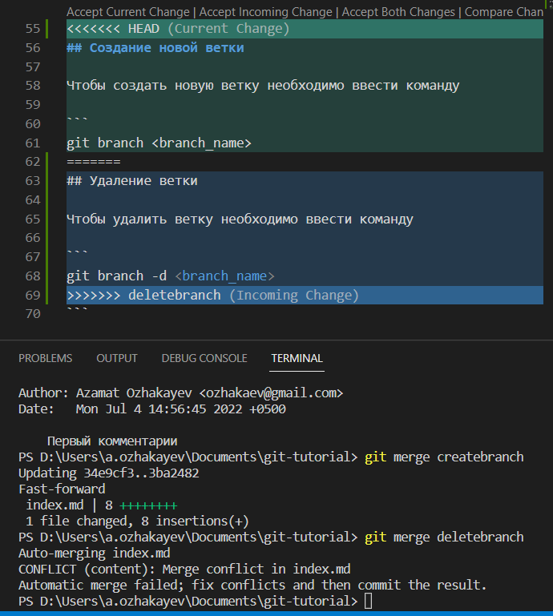

# Основные команды Git
## Инициализация нового репозитория

Войдите в папку с файлами проекта и введите команду
```
git init
```
## Добавление файла в коммит

Создайте файл с нужным содержимым и введите команду

```
git add <filename>
```

## Проверка файла

Проверить добавлен ли файл можно через команду

```
git status
```

## Сделать коммит

Сделайте коммит с помощью команды

```
git commit -m "<comment>"
```
## Просмотр списка коммитов

Просмотр списка коммитов можно просмотреть через команду

```
git log
```

## Возвращение к версиям коммитов

Чтобы переити к версиям коммитов необходимо скопировать ID коммита с ответа прошлой команды git log и вставить в следующую команду

```
git checkout <id>
```

## Возвращение к ветке

Чтобы переити к выбранной ветке необходимо ввести команду

```
git checkout <branch>
```

## Создание новой ветки

Чтобы создать новую ветку необходимо ввести команду

```
git branch <branch_name>
```

## Удаление ветки

Чтобы удалить ветку необходимо ввести команду

```
git branch -d <branch_name>
```

## Мерджинг

Чтобы сделать мерджинг с ветки введите команду

```
git merge <branch_name>
```

## Скрин конфликта

При попытке мерджинга если алгоритм гита не может сделать слияние без вашего участия то Гит выдаст вот такой конфликт:
